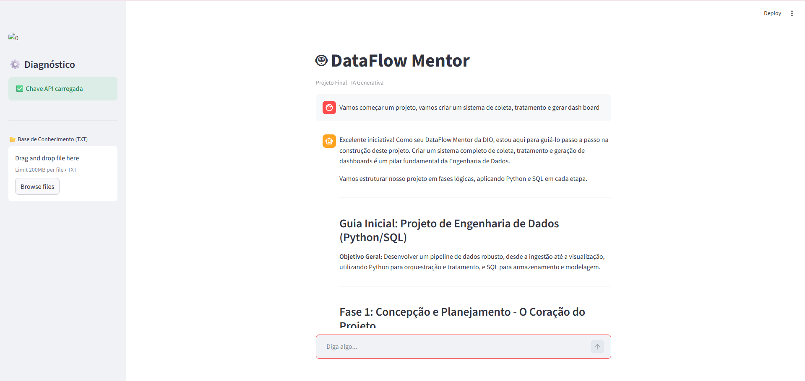

# 🤖 DataFlow Mentor - Assistente Virtual com IA Generativa

O **DataFlow Mentor** é um assistente inteligente especializado, desenvolvido como projeto final para o desafio da **DIO (Digital Innovation One)**. Ele foi projetado para auxiliar profissionais e estudantes de **Engenharia de Dados** no desenvolvimento de pipelines, depuração de códigos e análise de documentações técnicas.

---

## 📋 Etapas do Desafio (Arquitetura do Projeto)

Seguindo os requisitos da plataforma DIO, o projeto cumpre os seguintes pilares:

### 1. Documentação do Agente
O agente foi configurado para atuar como um mentor sênior. Sua persona é técnica, objetiva e focada em resolver problemas reais de Data Engineering, como integração de APIs, ETL e modelagem de dados.

### 2. Base de Conhecimento (RAG)
O projeto utiliza uma arquitetura de **RAG (Retrieval-Augmented Generation)** simplificada. O usuário pode realizar o upload de arquivos `.txt` (como documentações de bibliotecas ou manuais de infraestrutura), que são usados pela IA como contexto prioritário para as respostas.

### 3. Engenharia de Prompts
Foram aplicadas técnicas de *System Instructions* para garantir que o modelo mantenha o tom profissional e o domínio técnico, evitando alucinações e garantindo respostas precisas para o ecossistema de dados.

### 4. Aplicação Funcional
Uma aplicação interativa construída com a seguinte stack:
* **Python**: Linguagem principal do projeto.
* **Streamlit**: Para a criação da interface visual dinâmica.
* **Google Gemini Pro API**: O motor de linguagem natural (LLM).
* **Python-dotenv**: Para o gerenciamento seguro de variáveis de ambiente.

### 5. Avaliação e Métricas
O assistente foi validado com testes de prompts complexos sobre Python (Pandas/Scrapy) e SQL. A performance foi otimizada utilizando o modelo `gemini-pro`, garantindo estabilidade e baixo tempo de resposta.

### 6. Pitch do Projeto
O DataFlow Mentor resolve a dificuldade de navegar em documentações extensas. Ele transforma dados estáticos em conhecimento conversacional, permitindo que o desenvolvedor foque na lógica de negócio enquanto a IA auxilia na sintaxe e infraestrutura.

---

## 🛠️ Como Instalar e Rodar o Projeto

### Pré-requisitos
* Python 3.10+
* Uma API Key do [Google AI Studio](https://aistudio.google.com/)

### Instalação

1.  **Clone o repositório:**
    ```bash
    git clone [https://github.com/SEU_USUARIO/dataflow-mentor.git](https://github.com/SEU_USUARIO/dataflow-mentor.git)
    cd dataflow-mentor
    ```

2.  **Instale as dependências:**
    ```bash
    pip install streamlit google-generativeai python-dotenv
    ```

3.  **Configuração:**
    Crie um arquivo `.env` na raiz do projeto e adicione sua chave:
    ```env
    GEMINI_API_KEY=SUA_CHAVE_AQUI
    ```

4.  **Execução:**
    ```bash
    streamlit run app.py
    ```

---

## 📸 Demonstração do Projeto


*Interface profissional com suporte a contexto e histórico de chat.*

---

## 👨‍💻 Desenvolvedor
**João Vitor Vargas Martins**
* Graduando em Ciência da Computação (Estácio - 2027)
* Junior Data Engineer & Embaixador DIO
* [LinkedIn](https://www.linkedin.com/in/joaovvargas) | [GitHub](https://github.com/Wenes11)